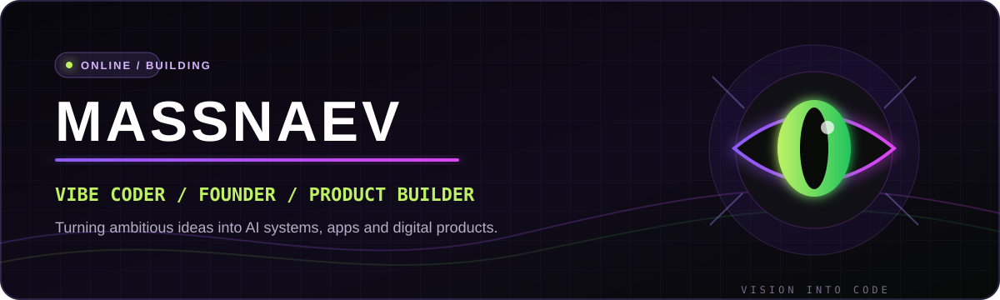

<div align="center">
  
</div>

<br />

<table>
  <tr>
    <td width="68%" valign="top">
      <h2>Building what does not exist yet.</h2>
      <p>
        I am <b>Massnaev</b>, a vibe coder and founder-builder turning raw ideas into
        working products. I move across AI, web, Telegram, automation and systems
        engineering, choosing the stack that gets the product into users' hands.
      </p>
      <p>
        Currently building <b>NVA New Vision Agency</b> and experimenting with local AI,
        intelligent infrastructure and product-first software.
      </p>
      <p><code>idea -> prototype -> product -> iterate</code></p>
    </td>
    <td width="32%" align="center" valign="middle">
      
    </td>
  </tr>
</table>

<div align="center">
  <a href="https://x.com/Massnaev"></a>
  <a href="https://t.me/Nikita_Massnaev"></a>
  <a href="https://www.instagram.com/massnaev_/"></a>
  <a href="https://www.threads.com/@massnaev_?hl=ru"></a>
  <a href="https://www.linkedin.com/in/%D0%BD%D0%B8%D0%BA%D0%B8%D1%82%D0%B0-%D0%BC%D0%B0%D1%81%D1%81%D0%BD%D0%B0%D0%B5%D0%B2-012951428/"></a>
</div>

## Selected builds

<table>
  <tr>
    <td width="50%" valign="top">
      <h3><a href="https://github.com/Massnaev/II-Model">Quantum</a></h3>
      <p>Local 0.5B AI router prototype plus an educational GPT architecture built from scratch.</p>
      <p><code>Python</code> <code>FastAPI</code> <code>LoRA</code> <code>Transformers</code></p>
    </td>
    <td width="50%" valign="top">
      <h3><a href="https://github.com/Massnaev/Folm">Folm</a></h3>
      <p>Adaptive dynamic QoS for Windows that protects games and calls from bufferbloat.</p>
      <p><code>Go</code> <code>WinDivert</code> <code>Networking</code> <code>ONNX</code></p>
    </td>
  </tr>
  <tr>
    <td width="50%" valign="top">
      <h3>MESS VPN</h3>
      <p>Telegram product with a customer bot, staff tools, web cabinet and payment integrations.</p>
      <p><code>Python</code> <code>Telegram</code> <code>Payments</code> <code>Web</code></p>
    </td>
    <td width="50%" valign="top">
      <h3><a href="https://nva-site-publish.vercel.app">NVA</a></h3>
      <p>Digital agency and product studio for websites, mini apps, presentations and MVPs.</p>
      <p><code>Web</code> <code>Product</code> <code>Design</code> <code>AI workflow</code></p>
    </td>
  </tr>
  <tr>
    <td width="50%" valign="top">
      <h3>Competitor Watch AI</h3>
      <p>AI-assisted product for monitoring competitors and turning market signals into action.</p>
      <p><code>TypeScript</code> <code>AI</code> <code>Automation</code> <code>Analytics</code></p>
    </td>
    <td width="50%" valign="top">
      <h3><a href="https://japan-route-russian-animated.vercel.app">Japan Route</a></h3>
      <p>An immersive, animated travel experience built around a visual route through Japan.</p>
      <p><code>TypeScript</code> <code>Motion</code> <code>Interactive UI</code></p>
    </td>
  </tr>
</table>

## What I build with

<div align="center">
  
</div>

<br />

```text
AI & R&D       local models, routing, LoRA, automation, intelligent products
Product        rapid prototypes, MVPs, interfaces, validation and iteration
Web            React, Next.js, TypeScript, responsive experiences
Systems        Go, Python, networking, Linux and service architecture
Telegram       bots, mini apps, payments and operational tooling
```

## Now

- Developing Quantum as a local routed AI system.
- Building NVA New Vision Agency with two co-founders.
- Shipping experiments at the intersection of AI, products and infrastructure.
- Open to ambitious collaborations and early-stage product work.

<div align="center">
  <br />
  
  <br /><br />
  <sub>Less ceremony. More shipping.</sub>
</div>
